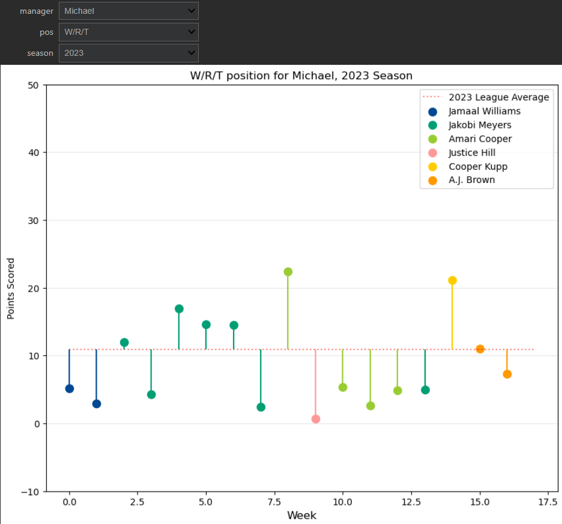

# Fantasy Football Data Analysis

Fantasy Football is a wealth of data, and a variety of interesting insights and visualizations can be generated within even a single league. For this project, I chose to acquire and use data from a Yahoo Fantasy Football league that I myself participated in from the years of 2015 to present day.

While the league extended further back, the players have remained overwhelmingly the same during this time period, allowing the opportunity for examining career statistics over an 8 season period. 

My goal was to create informative, interactive visualizations and statistics tables that would be used as input to a league-wide newsletter that primarily focused on the most recent season. However, the visualizations developed are set up such that any previous season can be examined just as easily.

## Quick Fantasy Football Primer

Fantasy football lets you become an NFL GM, drafting real players to your virtual team. Each week throughout an NFL season, their actual on-field stats earn you points, and you compete head-to-head with other teams. Teams win by having the highest total points scored. 

Glossary:
- "Manager": the individual acting as a GM, effectively a person running the team
- "Player": refers to the NFL player on the virtual team
- "Points for": Combined points of the players, usually in the context

## Data Acquisition

Data from our specific league was acquired using the Yahoo Fantasy API through the [YFPY wrapper](https://yfpy.uberfastman.com/index.html) (credit to Wren J. R. (uberfastman)).

In many cases the raw response data from YFPY was converted to .CSV files for easy later use and export to other interested parties. 

Please reference YFPY documentation for instructions on incorporating Yahoo OAuth credentials should you wish to make use of any of this code - as that has been purposely omitted from this repo.

| Directory | Contents |
|---|---|
|code| Notebooks dedicated to data generation, aggregation, cleaning, and modeling |
|data|Contains generated .csv files ranging from standings, player data, rosters, and matchup summaries. Data can be raw (comprehensive from YFPY) or tidy (containing only features of interest)|
|output|A directory used for YFPY Data collections, largely used only for storing league-specific game keys and league IDs|
|viz| Notebooks with code dedicated to static and interactive visualizations
|images| Contains some sample images |

## Progress To Date
-------------
## Analysis points of interest

- Career head to head records against other managers
- Win percentage over time for a selected manager
- Seasonal "points for" distribution/density plots, featuring an incorporated dataframe highlighting unlucky and lucky results
- 5 number summaries for "points for" per season, available by manager and featuring easy comparison to league-wide summary; sorting capabilities
- Year-Over-Year analysis of "points for" statistics
- "High score" explorer by manager and the resulting match output
- Points scored summaries by fantasy football position (RB1, RB2, etc) over the league lifespan
- Points scored visualization by week, by manager per season featuring player names and started week. Scores are compared to league average for the position
- Highest and lowest scoring player for season 2023
- Points distribution by NFL position (combines RB, WR) for 2023 season
- Points scored by NFL position per manager heatmap, showing scoring strengths and weaknesses by NFL position

## Example visualizations
Career head-to-head

Points scored by position, by season, interactive explorer

"Points for" density by outcome, interactive explorer

Season statistics dataframe explorer

